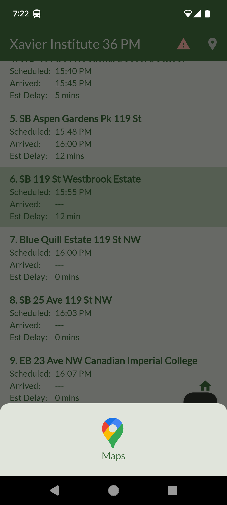

# Track My Bus

### Track My Bus is a user-friendly app designed for the student transportation community, offering real-time tracking of school buses. It supports both List View and Map View of bus stops, with automatic and manual status updates. Stay informed with live route information, pull-down notification displays of bus status, and seamless Google Maps integration for navigation to the exact location—ensuring a safer and more efficient commute.

## Showcase

